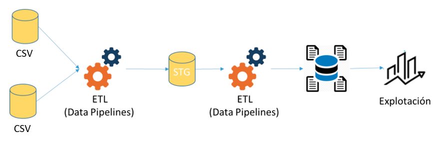
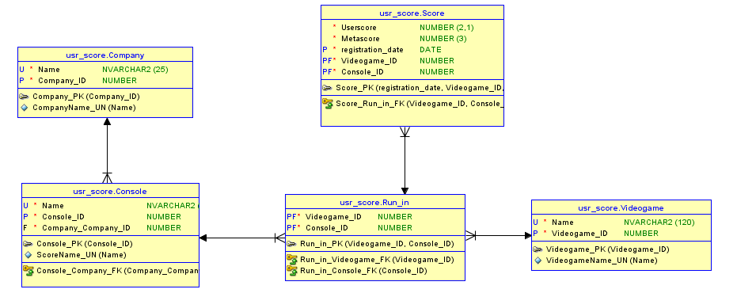
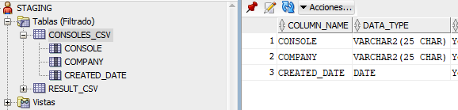
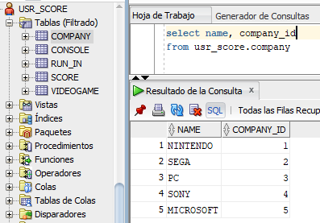
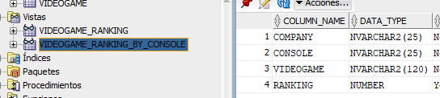
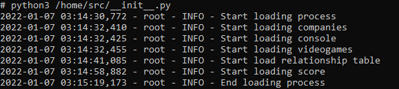
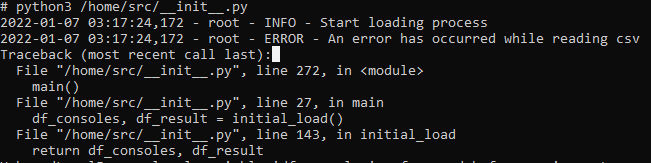
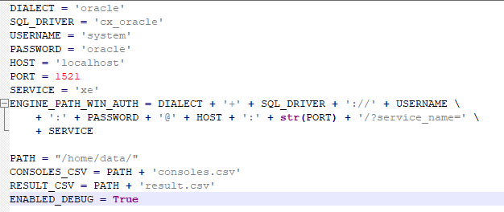
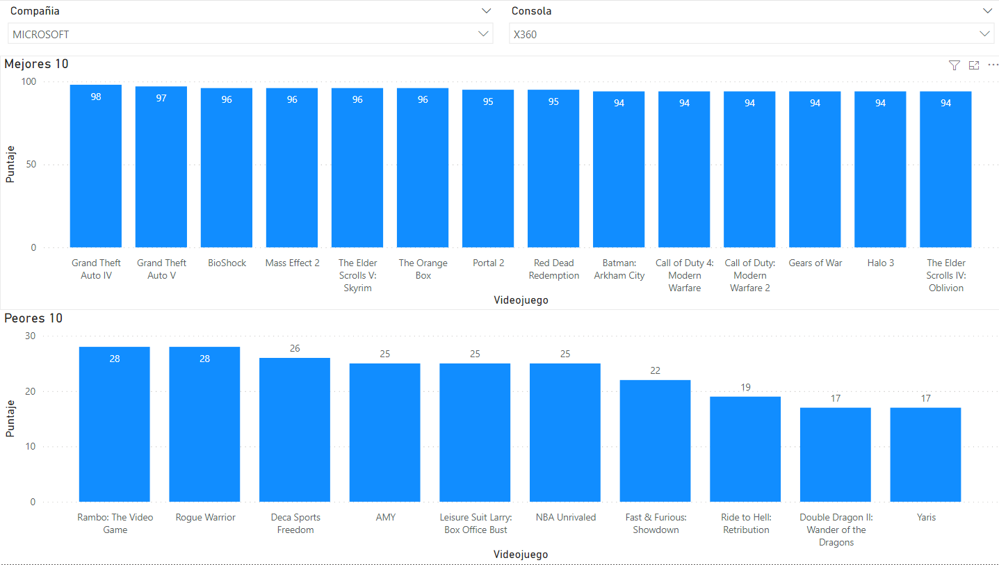

# Data Engineer - Challenge
El proyecto considera los siguientes puntos:
- Despliegue en contenedor: El proyecto considera un DOCKERFILE que despliega la base de datos y el código en un contenedor de forma que pueda implementarse de forma simple y rápida.
- Modelo de datos: El modelo de datos se realizó con la herramienta SQL Modeler. Si bien en los proyectos de BI tradicional se considera modelar de forma desnormalizada (copo de nieve o estrella) para este caso se realiza el modelo en 3FN. El modelo se desplego en Oracle.
- Código Python: EL código Python que realiza la carga de los datos se encuentra en la carpeta src. El fichero __init__ posee la lógica del ETL. Se utilizan los módulos pandas, cx_Oracle, sqlalchemy.
- Jupyter Notebook: El nootebook posee código Python que genera los distintos rankings indicados. Se considera esta herramienta para analistas más avanzados. Requiere los mismos módulos que el código en Python.
- Reporte Power BI: Adicional al Notebook Jupyter, se agregó un Power BI que permite la interacción más simple con la data.

# Arquitectura de Solución
Si bien el problema presenta múltiples soluciones se determinó realizar un proceso de carga típico de BI Tradicional.
 

# Persistencia de datos 
## Modelo
Para el proyecto se normalizo la base de datos ha tercera forma normal. 
 

## Base de datos
Dentro de la base de datos se creó un esquema para la carga de los archivos iguales al origen. Con esto se puede hacer una revisión de la data original y encontrar posibles problemas en la carga. Además de conocer la fecha en la que cargo el registro:

 

Posteriormente se persiste la data en las tablas en tercera forma normal:

 

Se crearon 2 vistas para facilitar las consultas de datos:
 

# Proceso de carga
## Ejecución docker
Para construir la imagen docker ejecutar (en la ruta del dockerfile) el siguiente comando:
```
docker build -t etl-videogames-score .
```

Para instanciar el contenedor se debe ejecutar el comando:
```
docker run --name videogame-score -d -p 49161:1521 etl-videogames-score
```
Requiere https://download.oracle.com/otn_software/linux/instantclient/214000/instantclient-basic-linux.x64-21.4.0.0.0dbru.zip. Si bien no debiese estar en el proyecto se deja para facilitar el proceso de despliegue entendiendo que es una prueba.

## Ejecución ETL
Para ejecutar el ETL se debe ejecutar el siguiente comando en el contenedor:
```
python3 /home/src/__init__.py
```

El proceso ETL considera la inserción o actualización de los datos.

## Log
El proyecto cuenta con la opción de visualizar logs para encontrar posibles errores:
 

En caso de errores muestra el detalle:
 

## Parámetros
Dentro del código existe un fichero con las configuraciones para la base de datos y la activación del log:
 

# Explotación de datos
## Reporte
Para el reporte se consideraron 2 opciones. Una, un Notebook para usuarios más avanzados en este [link](https://github.com/user/repo/blob/branch/other_file.md)

La otra opción es un BI de autoservicio en Power BI.
 
